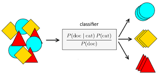
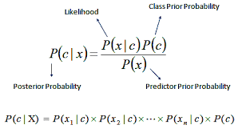
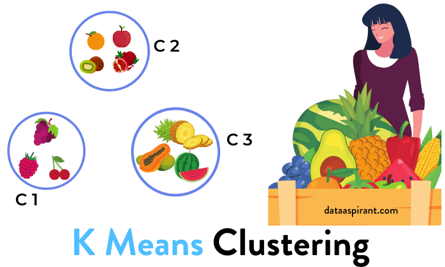
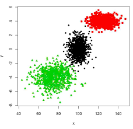

# Naive Bayes and K Mean Clustring 
>Naive Bayes 

Naïve Baye is Classification (Supervise) Learning Algorithm.

Naïve Bayes uses Bayes' Theorem, combined with a ("naive") presumption of conditional independence, to predict the value of a target (output), from evidence given by one or more predictor (input) fields.

The Naive Bayes Classifier technique is based on Bayesian theorem and is particularly suited when the dimensionality of the inputs is high.

Despite its simplicity, Naive Bayes can often outperform more sophisticated classification methods.

Based on concept of Prior Probability and Likelihood and Posterior Probability

~~~ statistics the decisions and inferences are puzzled out by applying the Bayesian reasoning. Thus precedent
events knowledge guides subsequent similar events.
In this algorithm, it is assumed that every trait of the data being classified is independent of all other traits given
the class. This assumption of independent dataset traits grounds it’s naming with the word naive. Bayes’
Theorem is denominated after prominent statistician Thomas Bayes.
It may be represented as:
P(h/e) = P(e/h) . P(h) = P(e/h). P(h)
P(e) P(e/h). P(h) + P(e/~h). P(~h)
Eqn 1: Baye’s Theorem [4]
 Where P(h) is the prior probability of hypothesis h.
 P(h/e) is the posterior probability of hypothesis h (in presence of the evidence e).
 P(e/h) is the likelihood of evidence e on hypothesis h.
A. Proceedings
The elucidated equation for classification may be put in writing as:
P( Class A| Trait 1, Trait 2) = P(Trait 1| Class A) . P(Trait 2| Class A) . P(Class A)
P(Trait 1). P(Trait 2)


~~~



---



>K means 

~~~ 
This algorithm divides M data points (which are in N dimensions) into K clusters in order to minimize the
within-cluster sum of squares. We try to achieve the "local" optima solutions such that no inter-cluster data
point manoeuvre reduces the within-cluster sum of squares. [1]
Basically, this algorithm creates k clusters and pairs similar type of objects in a unique cluster. Thus k clusters
are formed in such a way that the constituents of a certain cluster are similar as compared to the non-cluster
constituents of a certain data set.
A. Proceedings
Initially, k initial cluster centres are selected and then iteratively refined as:
1. Each instance di is assigned to its closest cluster centre.
2. Each cluster centre Cj is then updated and this becomes equivalent to the mean of its elemental
instances. [2]
These steps are iterated until no further change is there in the apportionment of instances to clusters. Simply we
may say that iterations are continued till cluster memberships are stabilized. This is called convergence.

 ~~~

 

---



 Algorithm Beginner Machine Learning Statistics Videos
Objective

    Naive Bayes is a fast, easy to understand, and highly scalable algorithm.
    Understand the working of Naive Bayes, its types, and use cases.

Introduction

Naive Bayes is one the most popular and beginner-friendly algorithms that anyone can use. In this article, we are going to explore the Naive Bayes Algorithm.

Note: If you are more interested in learning concepts in an Audio-Visual format, We have this entire article explained in the video below. If not, you may continue reading.

 
Concept  Behind Naive Bayes

Let’s First understand how Naive Bayes works through an example. We have a dataset with some features Outlook, Temp, Humidity, and Windy, and the target here is to predict whether a person or team will play tennis or not. So, we are representing features as X like X1, X2, and so on. Similarly, the classes are represented as C1 and C2.

Naive Bayes Algorithm Data

In Naive Bayes for every observation, we determine the probability that it belongs to class 1 or class 2. For example, here we first find out the probability that the person will play given that Outlook is Sunny, Temperature is Hot, Humidity is High and it is not windy as shown below. Later, we will also calculate the probability that the person will not play given the same conditions. This is repeated for all the rows.

Naive Bayes Algorithm Data 2

So this is in a way calculating the conditional probability, where we try to predict the class based on the conditions or the features here.

 
Conditional Probability

Recall the formula of conditional probability

Conditional Probability naive bayes algorithm

In this case, we have the probability of E1 for a given condition E2. Here, we are predicting the probability of class1 and class2 based on the given condition. If I try to write the same formula in terms of classes and features, we will get the following equation

Now we have two classes and four features, so if we write this formula for class C1, it will be something like this.

formula for class C1

Here, we replaced Ck with C1 and X with the intersection of X1, X2, X3, X4. You might have a question, why we are taking the intersection? It’s because we are taking the situation when all these features are present at the same time.

The Naive Bayes algorithm assumes that all the features are independent of each other or in other words all the features are unrelated. With that assumption, we can further simplify the above formula and write it in this form

Naive Bayes algorithm assumes

 

This is the final equation of the Naive Bayes and we have to calculate the probability of both C1 and C2.

For this particular example-

probability of both C1 and C2

This means we have to find the probability of a person will play or not based on the given features. Whichever the probability is higher is taken as the final class.

 
# Types of Naive Bayes

Now let’s discuss different types of Naive Bayes algorithm and which is used when. So, we have three types
# Gaussian Naive Bayes

This type of Naive Bayes is used when variables are continuous in nature. It assumes that all the variables have a normal distribution. So if you have some variables which do not have this property, you might want to transform them to the features having distribution normal.
# Multinomial Naive Bayes

Next comes the multinomial Naive Bayes. This is used when the features represent the frequency.

Suppose you have a text document and you extract all the unique words and create multiple features where each feature represents the count of the word in the document. In such a case, we have a frequency as a feature. In such a scenario, we use multinomial Naive Bayes.

It ignores the non-occurrence of the features. So, if you have frequency 0 then the probability of occurrence of that feature will be 0 hence multinomial naive Bayes ignores that feature. It is known to work well with text classification problems.
# Bernoulli Naive Bayes

This is used when features are binary. So, instead of using the frequency of the word, if you have discrete features in 1s and 0s that represent the presence or absence of a feature. In that case, the features will be binary and we will use Bernoulli Naive Bayes.

Also, this method will penalize the non-occurrence of a feature, unlike multinomial Naive Bayes.
Advantages of Naive Bayes

   > Here are some advantages of the Naive Bayes algorithm.


   ``` This algorithm is easier to build and simpler to understand.
    It is much faster than the other algorithms as it is just calculating the probabilities.
    Naive Bayes is easily scalable hence widely used in the industry.
    It is a popular choice for text classification problems.```

    
